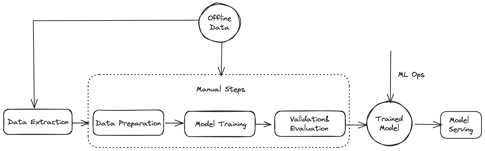

# BNB Greenfield dApp Wishlist

Welcome to the BNB Greenfield Challenge Wishlist! Our community has outlined exciting challenges to foster innovation and enhance the BNB Greenfield ecosystem. 

| Challenge                                                    | Importance | Status |
| ------------------------------------------------------------ | ---------- | ------ |
| [Adapt Greenfield to Python Machine Learning Pipelines ](#challenge-adapt-greenfield-to-python-machine-learning-pipelines) | High       | Active |
| [Publishing Platform on BNB Greenfield ](#challenge-publishing-platform-on-bnb-greenfield) | High       | Active |
| [Knowledge Sharing Platform BNB Greenfield ](#challenge-knowledge-sharing-platform-bnb-greenfield) | Medium     | Active |
| [Blockchain of Things(BoT) BNB Greenfield](#challenge-blockchain-of-thingsbot-bnb-greenfield) | Medium     | Active |
| [Decentralized AI Training - AI Labeling on BNB Greenfield](#challenge-decentralized-ai-training---ai-labeling-on-bnb-greenfield) | High       | Active |

# Challenges


## Challenge: Adapt Greenfield to Python Machine Learning Pipelines

### Main Objectives/Goals

The main goal of this task is to build a new Python library for accessing Greenfield files. This library will enable machine learning researchers/developers to interact with the Greenfield ecosystem without leaving the comfort of python and jupyter notebook.

### Challenge Description


As shown in the diagram above, In the popular pipeline of machine learning, Jupyter Notebook allows developers to see the code results in-line without depending on other parts of the code. In Jupyter Notebook, every cell of the code can be viewed at any time to come up with a result. [Fsspec](https://filesystem-spec.readthedocs.io/en/latest/) is commonly used in Jupyter Notebook, as the process of machine learning is data intensive and developers may need to access datasets from different sources.

An readonly implementation of [Fsspec](https://filesystem-spec.readthedocs.io/en/latest/) for Greenfield will provide a read-only python-style interface to Greenfield storage network public files. With this new library, you can get files from Greenfield. It will help users quickly retrieve files with url.
A simple download data example would look like:

```python
import gnfsspec

with gnfsspec.open("https://greenfield-sp.bnbchain.org/view/bucketname/filename", "r") as f:
    print(f.read())
```


### What should you consider when building this library?
* Performance: how to achieve fast retrieval
* How to integrate [Resumable Download feature](https://docs.bnbchain.org/greenfield-docs/docs/tutorials/dapp/resumable-upload/overview ) of Greenfield
* Prepare Documentation and Demos
* Source code for all of the above


## Challenge: Publishing Platform on BNB Greenfield

### Main Objectives/Goals
1. Tokenize the content and exchange on the platform
1. Achieve the data content ownership with blockchain technology
1. Implement anti-piracy measures

### Priority 

High, Medium, Low

### Challenge Description
We are looking for a publishing platform that can leverage the benefits of BNB Greenfield, a decentralized storage network that offers high performance, low cost, and censorship resistance. The platform should allow authors to upload their work to BNB Greenfield and automatically sync it with BNB Smart Chain, where they can sell their work using smart contracts. The platform should also provide anti-piracy measures to protect the intellectual property rights of the authors and prevent unauthorized copying or distribution of their work. The platform should be user-friendly, scalable, and secure. We are interested in proposals that can demonstrate the feasibility, functionality, and innovation of the publishing platform. 


## Challenge: Knowledge Sharing Platform BNB Greenfield

### Main Objectives/Goals

1. Explore dynamic and attracting knowledge sharing application with decentralized storage network
2. Manage permission via smart contract

### Challenge Description

We are looking for a talented and visionary developer to build a knowledge sharing platform that leverages the power of Greenfield decentralized storage network and BSC smart contract. The platform should enable users to create, share, and monetize their knowledge in various formats, such as text, audio, and video. The platform should also allow users to customize their profiles, join or create subscription-based private channels, and receive direct donations from their followers. The platform should be user-friendly, scalable, and secure, and should offer a competitive edge over existing platforms like Twitter(X) and Mirror.xyz.


## Challenge: Blockchain of Things(BoT) BNB Greenfield

### Main Objectives/Goals

1. Seamless data collection and storage 
2. Enhanced security and reliability of IoT data

### Challenge Description

The objective of this proposal is to design and implement a Blockchain of Things (BoT) system that can enable seamless data collection and storage from IoT devices on the BNB Greenfield decentralized storage network. The proposed system will leverage the advantages of blockchain technology, such as immutability, transparency, and distributed consensus, to enhance the security and reliability of IoT data. 

The proposed system will provide several benefits for IoT data collection and storage, such as:

- Reduced cost and complexity of data management by eliminating the need for centralized servers or intermediaries.
- Increased security and privacy of data by using encryption, hashing, and digital signatures.
- Improved scalability and performance of data transfer and storage by using a distributed network of peers.
- Enhanced trust and transparency of data by using blockchain technology to ensure data integrity and provenance.


## Challenge: Decentralized AI Training - AI Labeling on BNB Greenfield

### Main Objectives/Goals

1. Efficient access control
2. Large, diverse user base for labeling
3. Programmable payments via BSC

### Challenge Description

We are looking for proposals to develop a decentralized AI training platform that leverages Greenfield, a novel decentralized storage network powered by BNB. 

The platform should enable users to contribute their data and annotations for creating high-quality AI datasets, and receive rewards in BNB tokens for their efforts. The platform should also provide efficient access control mechanisms to ensure data privacy and security, as well as programmable payments via smart contracts to facilitate transactions. The platform should aim to attract a large and diverse user base for labeling various types of data, such as images, text, audio, video, etc.


